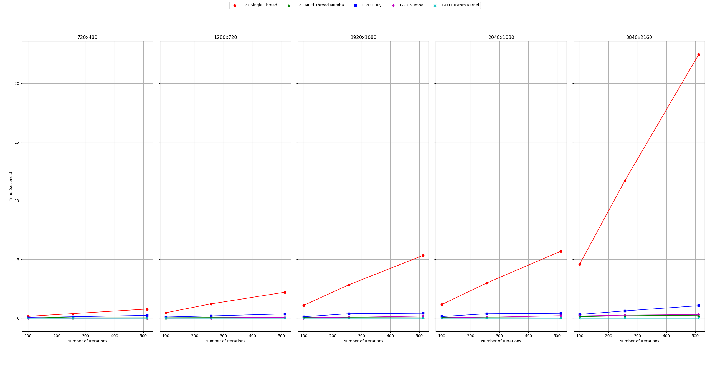
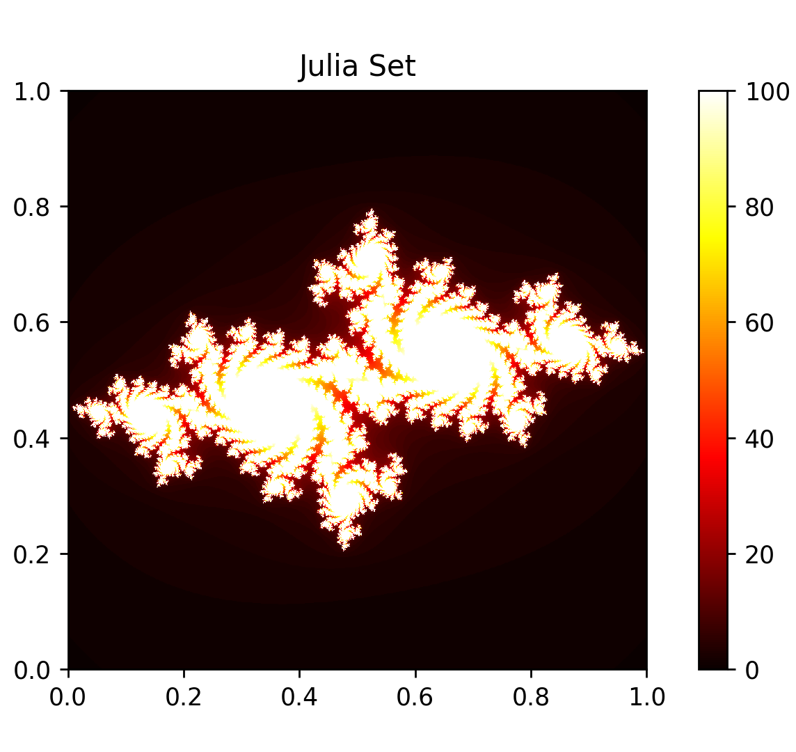
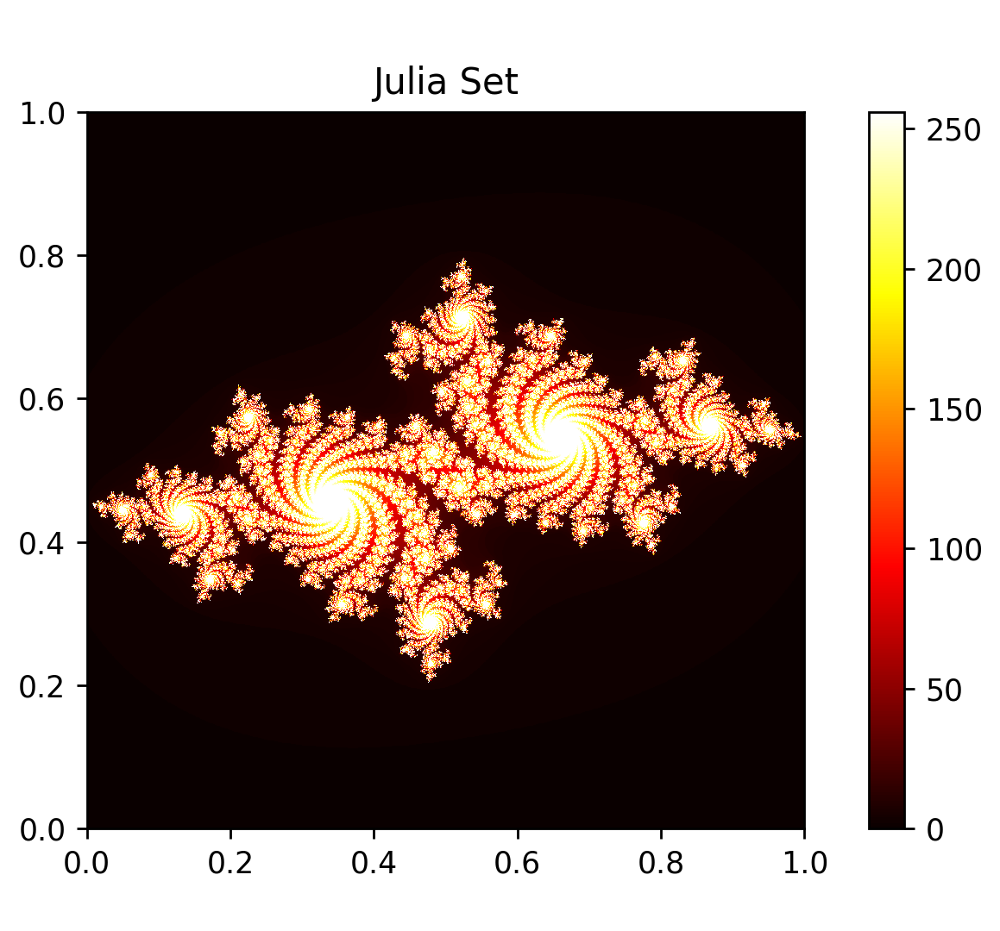
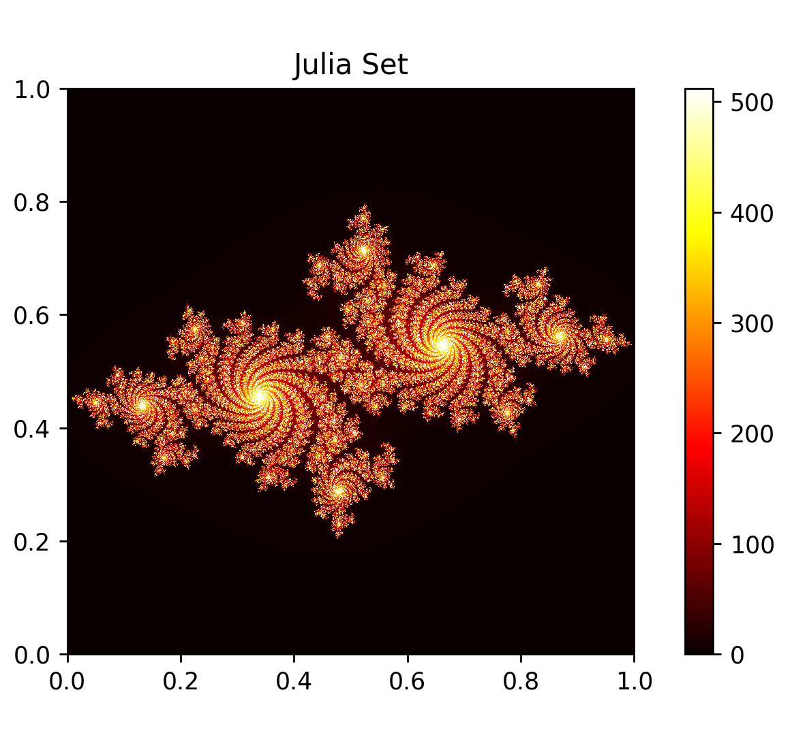

# Julia Set Performance Tests

This project evaluates the performance of generating Julia sets using various computational methods, including single-threaded CPU, multi-threaded CPU with Numba, and GPU-based methods (Numba, CuPy, and custom kernels).

## Libraries Used
- Numba
- CuPy
- Custom GPU Kernels

## Results
The experiments were conducted on various resolutions and iteration counts, comparing the execution time for each implementation.

### Comparison of Execution Times

| Resolution    | Iterations | Single-threaded CPU (s) | Multi-threaded CPU (Numba) (s) | GPU (Numba) (s) | GPU (CuPy) (s) | GPU (Custom Kernel) (s) |
|---------------|------------|-------------------------|-------------------------------|-----------------|----------------|-------------------------|
| 720x480       | 100        | 0.1576                  | 0.0988                        | 0.0132          | 0.0514         | 0.000049                |
| 720x480       | 256        | 0.3922                  | 0.0110                        | 0.0039          | 0.1249         | 0.000077                |
| 720x480       | 512        | 0.7753                  | 0.0137                        | 0.0088          | 0.2394         | 0.000405                |
| 1280x720      | 100        | 0.4641                  | 0.0158                        | 0.0059          | 0.1018         | 0.000487                |
| 1280x720      | 256        | 1.2164                  | 0.0288                        | 0.0099          | 0.1934         | 0.000192                |
| 1280x720      | 512        | 2.2099                  | 0.0380                        | 0.0575          | 0.3642         | 0.000110                |
| 1920x1080     | 100        | 1.0978                  | 0.0344                        | 0.0081          | 0.1290         | 0.000101                |
| 1920x1080     | 256        | 2.8430                  | 0.0618                        | 0.0753          | 0.3810         | 0.000154                |
| 1920x1080     | 512        | 5.3378                  | 0.0796                        | 0.1832          | 0.4250         | 0.000212                |
| 2048x1080     | 100        | 1.1620                  | 0.0362                        | 0.0084          | 0.1437         | 0.000105                |
| 2048x1080     | 256        | 2.9988                  | 0.0678                        | 0.0909          | 0.3732         | 0.000157                |
| 2048x1080     | 512        | 5.7021                  | 0.0874                        | 0.2156          | 0.4192         | 0.000212                |
| 3840x2160     | 100        | 4.6115                  | 0.1321                        | 0.1890          | 0.3226         | 0.000174                |
| 3840x2160     | 256        | 11.7000                 | 0.2061                        | 0.2584          | 0.6199         | 0.000308                |
| 3840x2160     | 512        | 22.4669                 | 0.2529                        | 0.3118          | 1.0606         | 0.000539                |

*Table 1: Execution times for various implementations and configurations.*

### Speedup on Parallel Execution Compared to Single-threaded CPU

| Resolution    | Iterations | Multi-threaded CPU (Numba) | GPU (Numba) | GPU (CuPy) | GPU (Custom Kernel) |
|---------------|------------|-----------------------------|-------------|------------|----------------------|
| 720x480       | 100        | 1.59x                       | 11.94x      | 3.07x      | 3216.33x             |
| 720x480       | 256        | 35.65x                      | 100.82x     | 3.14x      | 5085.19x             |
| 720x480       | 512        | 56.59x                      | 87.98x      | 3.24x      | 1914.19x             |
| 1280x720      | 100        | 29.38x                      | 81.42x      | 4.56x      | 952.63x              |
| 1280x720      | 256        | 42.23x                      | 122.86x     | 6.29x      | 6325.53x             |
| 1280x720      | 512        | 58.16x                      | 38.41x      | 6.07x      | 20090.63x            |
| 1920x1080     | 100        | 31.90x                      | 135.12x     | 8.51x      | 10845.87x            |
| 1920x1080     | 256        | 45.98x                      | 37.69x      | 7.47x      | 18099.35x            |
| 1920x1080     | 512        | 67.04x                      | 29.17x      | 12.56x     | 25181.13x            |
| 2048x1080     | 100        | 32.08x                      | 138.26x     | 8.09x      | 11061.90x            |
| 2048x1080     | 256        | 44.24x                      | 33.05x      | 8.03x      | 19114.84x            |
| 2048x1080     | 512        | 65.24x                      | 26.44x      | 13.60x     | 26873.11x            |
| 3840x2160     | 100        | 34.90x                      | 24.24x      | 14.30x     | 26587.36x            |
| 3840x2160     | 256        | 56.80x                      | 45.26x      | 18.88x     | 38125.55x            |
| 3840x2160     | 512        | 88.85x                      | 72.07x      | 21.17x     | 41675.24x            |

*Table 2: Speedup of parallel execution methods compared to single-threaded CPU.*

### Matplot lib plot of the Table 1

*Figure 1: Plot of all methods.*

### Visual Representation

#### Julia Fractals with Different Iterations

*Figure 2: Julia set with 100 iterations.*

*Figure 3: Julia set with 256 iterations.*

*Figure 4: Julia set with 512 iterations.*

## Conclusion
The performance tests demonstrate significant speedups when using parallel execution methods, particularly GPU-based methods, for generating Julia sets. The custom GPU kernel method consistently outperforms others, achieving the highest speedup ratios.