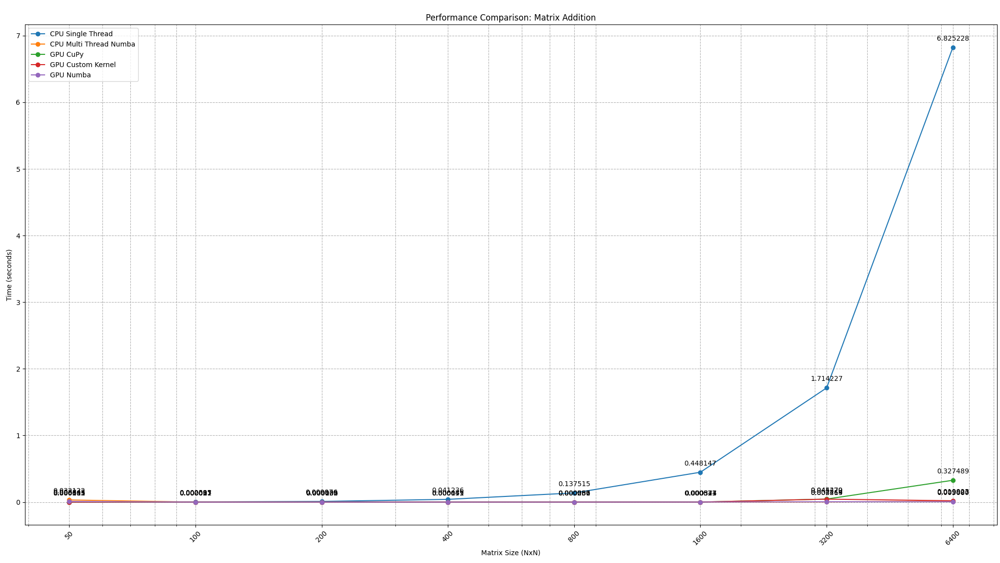
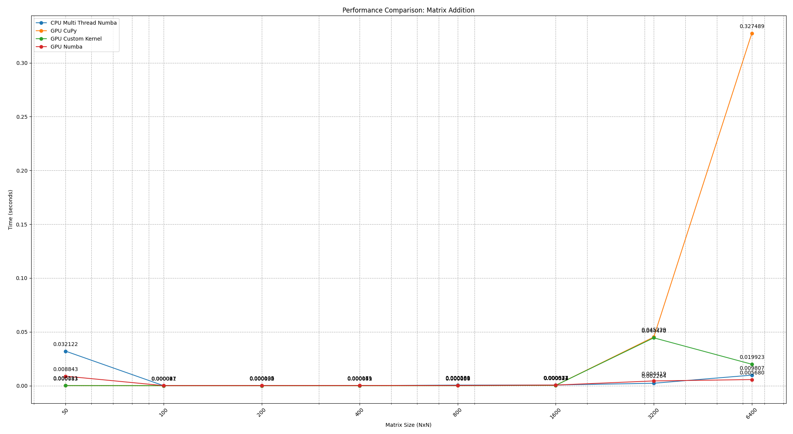

# Matrix Addition
Problem formulation: We want to add the elements from the same index of two matrices called `A` and `B` into a matrix `C`.

Libraries used: CuPy, Numba.

## Results
The experiments were done on:
- CPU sequential;
- CPU parallel (Numba);
- GPU parallel (Numba);
- GPU parallel (CuPy);
- GPU parallel (Custom Kernel);

### Comparison between CPU Sequential, CPU Parallel, GPU Parallel for Matrix Addition

| Nr. of runs | Impl            | 50 x 50 (seconds) | 100 x 100 (seconds) | 200 x 200 (seconds) | 400 x 400 (seconds) | 800 x 800 (seconds) | 1600 x 1600 (seconds) | 3200 x 3200 (seconds) | 6400 x 6400 (seconds) |
|-------------|-----------------|--------------------------|----------------------------|----------------------------|----------------------------|----------------------------|------------------------------|------------------------------|------------------------------|
| 10          | Sequential      | 0.0005847700             | 0.0025948600               | 0.0099755100               | 0.0412357500               | 0.1375154900               | 0.4481469000                 | 1.7142266800                 | 6.8252284600                 |
| 10          | CPU Numba       | 0.0321221300             | 0.0000167100               | 0.0000317100               | 0.0000486600               | 0.0005296500               | 0.0006313200                 | 0.0022644200                 | 0.0098072000                 |
| 10          | GPU Numba       | 0.0088434400             | 0.0000674900               | 0.0001045600               | 0.0001710300               | 0.0002014700               | 0.0005772000                 | 0.0044189100                 | 0.0056800900                 |
| 10          | GPU CuPy        | 0.0001105200             | 0.0000310300               | 0.0000332200               | 0.0000512100               | 0.0000571100               | 0.0003240300                 | 0.0452285300                 | 0.3274885200                 |
| 10          | GPU Custom Kernel | 0.0000832300             | 0.0000274200               | 0.0000295900               | 0.0000409100               | 0.0000657800               | 0.0003428500                 | 0.0444704600                 | 0.0199228500                 |

*Table 1: Comparison between CPU Sequential, CPU Parallel, GPU Parallel for Matrix Addition.*

### Speedup on Parallel Execution Compared to Sequential on Matrix Addition

| Impl            | 50 x 50 | 100 x 100 | 200 x 200 | 400 x 400 | 800 x 800 | 1600 x 1600 | 3200 x 3200 | 6400 x 6400 |
|-----------------|----------------|------------------|------------------|------------------|------------------|--------------------|--------------------|--------------------|
| CPU Numba       | 0.018x         | 155.287x         | 314.585x         | 847.426x         | 259.634x         | 709.856x           | 757.026x           | 695.940x           |
| GPU Numba       | 0.066x         | 38.448x          | 95.404x          | 241.102x         | 682.560x         | 776.415x           | 387.929x           | 1201.605x          |
| GPU CuPy        | 5.291x         | 83.624x          | 300.286x         | 805.228x         | 2407.905x        | 1383.041x          | 37.901x            | 20.841x            |
| GPU Custom Kernel | 7.025x         | 94.633x          | 337.124x          | 1007.962x        | 2090.536x        | 1307.122x          | 38.547x            | 342.582x           |

*Table 2: Speedup on Parallel Execution Compared to Sequential on Matrix Addition.*

### Matplot lib plot of the Table 1

### Matplot lib plot of the Table 1 parallel impl (parallel only).

