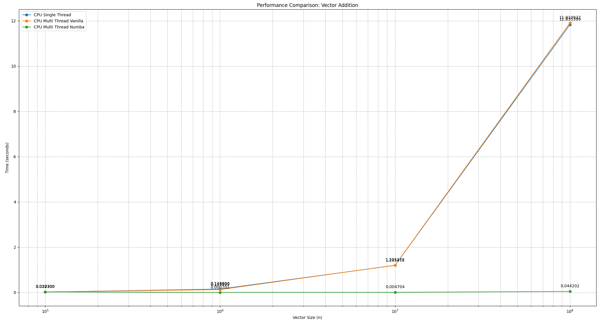
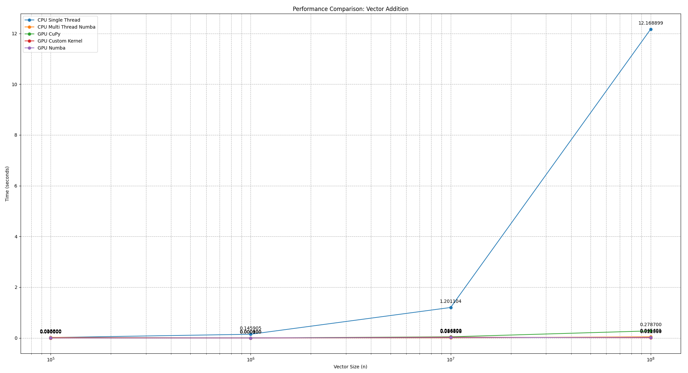
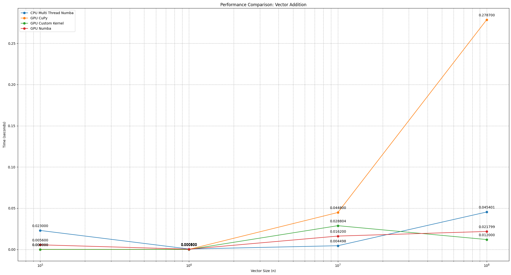

# Vector addition
Problem formulation: We want to add the elements from the same index of two vectors called `a` and `b` into a vector `c`.

Libraries used: CuPy, Numba. 

## Results
The experiments were done on: 
- CPU sequential;
- CPU parallel (vanilla python);
- CPU parallel with Numba;
- GPU parallel with Numba;
- GPU parallel with CuPy;

### Results of CPU Sequential/Parallel runs and their speedups

| Nr. of runs | Impl            | 10^5 (seconds) | 10^6 (seconds) | 10^7 (seconds) | 10^8 (seconds) | Speedup (10^5) | Speedup (10^6) | Speedup (10^7) | Speedup (10^8) |
|-------------|-----------------|----------------|----------------|----------------|----------------|----------------|----------------|----------------|----------------|
| 10          | Sequential      | 0.017300       | 0.148800       | 1.195475       | 11.835399      |                |                |                |                |
| 10          | Parallel Vanilla| 0.020700       | 0.123999       | 1.201112       | 11.910937      | 0.8367x        | 1.2006x        | 0.9953x        | 0.9937x        |
| 10          | Parallel Numba  | 0.022700       | 0.000701       | 0.004704       | 0.044202       | 0.7621x        | 212.411x       | 254.135x       | 267.698x       |

*Table 1: Results of CPU Sequential/Parallel runs and their speedups.*

### Matplot lib plot of the Table 1

### Comparison between CPU Sequential, CPU Parallel, GPU Parallel

| Nr. of runs | Impl               | 10^5 (seconds) | 10^6 (seconds) | 10^7 (seconds) | 10^8 (seconds) | Speedup (10^5) | Speedup (10^6) | Speedup (10^7) | Speedup (10^8) |
|-------------|--------------------|----------------|----------------|----------------|----------------|----------------|----------------|----------------|----------------|
| 10          | Sequential         | 0.0166047100   | 0.1429307300   | 1.1719473900   | 11.872801800   |                |                |                |                |
| 10          | CPU Numba          | 0.0246411900   | 0.0005784900   | 0.0045634300   | 0.0459598300   | 0.673x         | 247.075x       | 256.812x       | 258.318x       |
| 10          | GPU Numba          | 0.0056764010   | 0.0002983500   | 0.0150725600   | 0.0219712000   | 2.925x         | 486.407x       | 77.753x        | 540.161x       |
| 10          | GPU CuPy           | 0.0000837400   | 0.0000902200   | 0.0326053800   | 0.2794807300   | 199.930x       | 1584.246x      | 35.942x        | 42.632x        |
| 10          | GPU Custom Kernel  | 0.0000738800   | 0.0000436800   | 0.0229561000   | 0.0124657700   | 224.752x       | 3272.22x       | 51.051x        | 952.390x       |

*Table 2: Comparison between CPU Sequential, CPU Parallel, and GPU Parallel.*

### Matplot lib plot of the Table 2

### Matplot lib plot of the Table 2 parallel impl.

