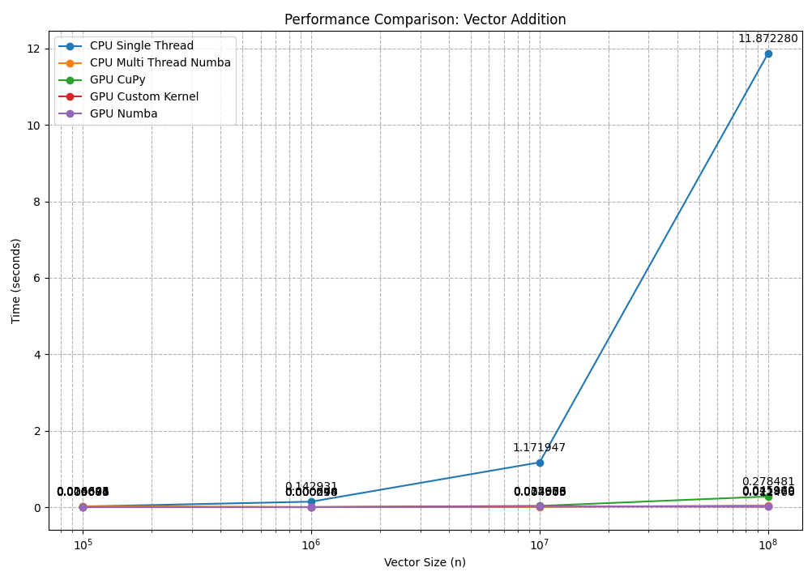
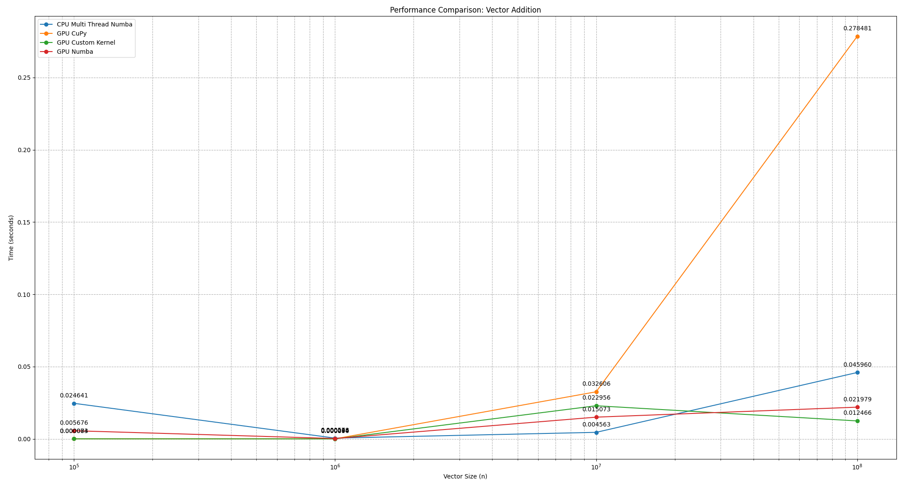

# Vector addition
Problem formulation: We want to add the elements from the same index of two vectors called `a` and `b` into a vector `c`.

Libraries used: CuPy, Numba. 

## Results
The experiments were done on: 
- CPU sequential;
- CPU parallel (vanilla python);
- CPU parallel with Numba;
- GPU parallel with Numba;
- GPU parallel with CuPy;

### Results of CPU Sequential/Parallel runs and their speedups

| Nr. of runs | Impl            | 10^5 (seconds) | 10^6 (seconds) | 10^7 (seconds) | 10^8 (seconds) | Speedup (10^5) | Speedup (10^6) | Speedup (10^7) | Speedup (10^8) |
|-------------|-----------------|----------------|----------------|----------------|----------------|----------------|----------------|----------------|----------------|
| 10          | Sequential      | 0.017300       | 0.148800       | 1.195475       | 11.835399      |                |                |                |                |
| 10          | Parallel Vanilla| 0.020700       | 0.123999       | 1.201112       | 11.910937      | 0.8367x        | 1.2006x        | 0.9953x        | 0.9937x        |
| 10          | Parallel Numba  | 0.022700       | 0.000701       | 0.004704       | 0.044202       | 0.7621x        | 212.411x       | 254.135x       | 267.698x       |

*Table 1: Results of CPU Sequential/Parallel runs and their speedups.

### Matplot lib plot of the Table 1

### Comparison between CPU Sequential, CPU Parallel, GPU Parallel

| Nr. of runs | Impl               | 10^5 (seconds)  | 10^6 (seconds)  | 10^7 (seconds)  | 10^8 (seconds)  | Speedup (10^5) | Speedup (10^6) | Speedup (10^7) | Speedup (10^8) |
|-------------|--------------------|-----------------|-----------------|-----------------|-----------------|----------------|----------------|----------------|----------------|
| 10          | Sequential         | 0.0164995670    | 0.1459046364    | 1.2011038065    | 12.1688993454   |                |                |                |                |
| 10          | CPU Numba          | 0.0229999304    | 0.0005003691    | 0.0044983625    | 0.0454012632    | 0.7174x        | 291.594x       | 267.001x       | 268.023x       |
| 10          | GPU Numba          | 0.0056002140    | 0.0003001690    | 0.0161995411    | 0.0217994690    | 2.946x         | 486.07x        | 74.144x        | 558.220x       |
| 10          | GPU CuPy           | 0.0000000000    | 0.0000999689    | 0.0448000193    | 0.2786999464    | instant*       | 1460x          | 26.810x        | 43.663x        |
| 10          | GPU Custom Kernel  | 0.0000000000    | 0.0000000000    | 0.0288044691    | 0.0119998932    | instant*       | instant*       | 41.699x        | 1014.08x       |

*Table 2: Comparison between CPU Sequential, CPU Parallel, and GPU Parallel.*

### Matplot lib plot of the Table 2

### Matplot lib plot of the Table 2 parallel impl.

